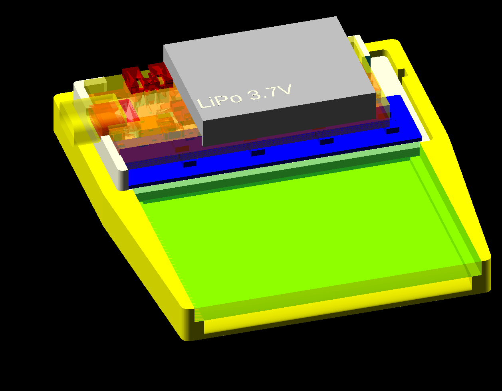

# Glowtape

Glow-in-the-dark display, 64 pixels wide, and as long as the memory allows :)

Using a UV LED pixel illumination from the [Glowxels](http://glowxels.org)
project.

To build: get all dependencies (if you're using nix: they are in shell.nix).
Mostly openscad, rp2040 sdk,
[bdfont.data](https://github.com/hzeller/bdfont.data) to store fonts,
[gcode-cli](https://github.com/hzeller/gcode-cli) used in the utility to set
time.

  * OpenSCAD case 
  * [firmware/](./firmware/)
  * [Gloxwls PCB](http://glowxels.org). Check out the 'narrow' branch.
  * [Encoder PCB](./pcb/encoder/) to pick up the encoder tape.
  * The sync-tape to be stuck to the back of the 50mm glow-in-dark
    tape: just `make` in the toplevel directory, it creates the PDF from
    the hand-written PostScript. Print on a high-resolution printer
    (e.g. 1200dpi) to minimize line-thickness variations due to aliasing.

The RP2040 RTC does not remember its time after a reset, so you need to
`./set-time.sh` after a flash or reset/battery outage.

## Action shot

