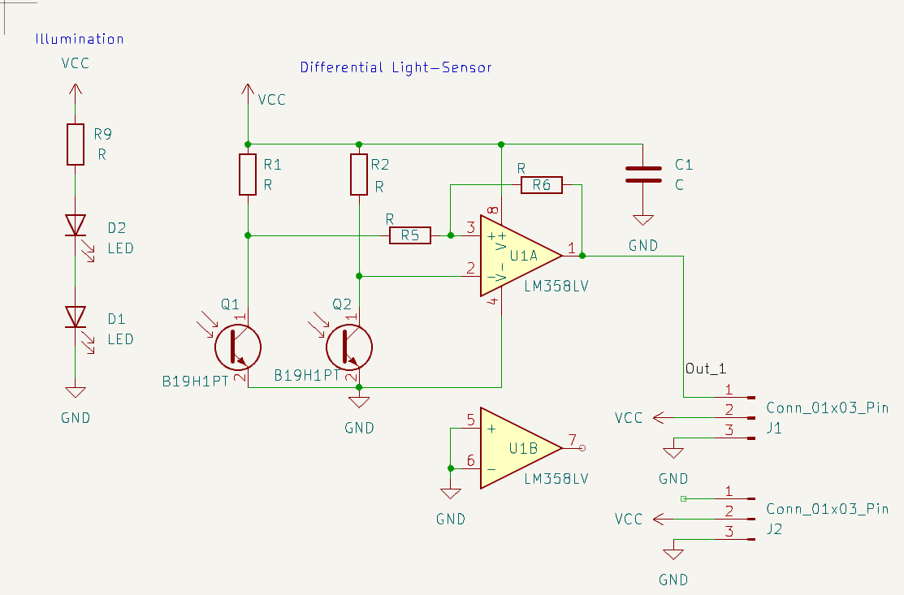
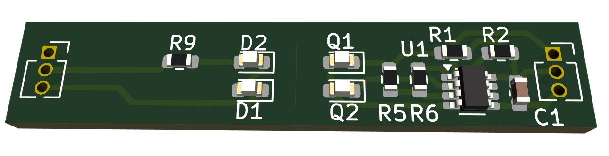
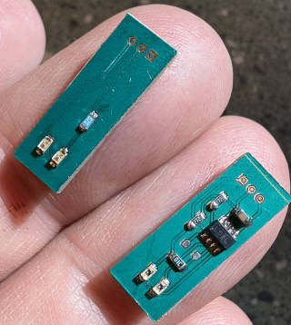

Encoder PCB.

Note, this looks like one PCB, but you need to cut it in half in the middle at
the line.

Single-sided, so easy to etch at home.

For better contrast, I laser-cut a dark thin tape with two 0.4mm slots, 2mm
apart and taped on the photo transistor.

The strip-pattern is picked up with one photo transistor picking up a dark
strip, the other the light strip. When the tape is moved, the light conditions
swap. So the differntial pick-up makes it resilient to environment light
conditions as there does not need to be a fixed cut-off.

Choose resistors as needed; For `R9` LED, 82Ω was used. The `R1`, `R2` photo
transistor resistors, 2.7kΩ, `R5`: 10kΩ, and `R6`, which makes the whole
circuit a Schmitt Trigger for confident switch detection, somehing like 180kΩ.

Here, a home-made isolation etch:

